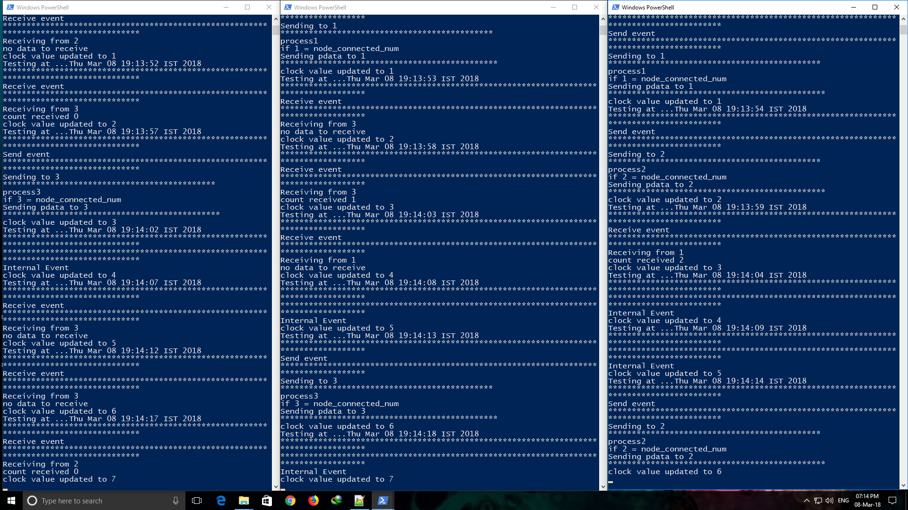

# Lamports-Logical-Clock
Lamports Logical Clock implementation in java using socket programming.

#Compile the files
javac *.java

#run each process
java Process [processId] [totalNumberOfProcesses]

#output sample

